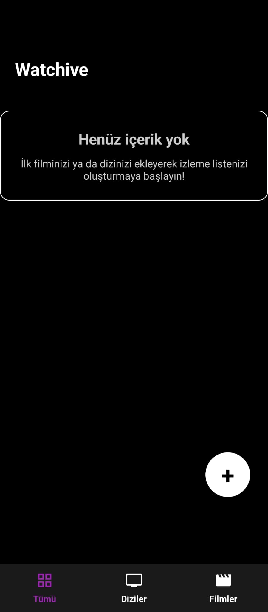
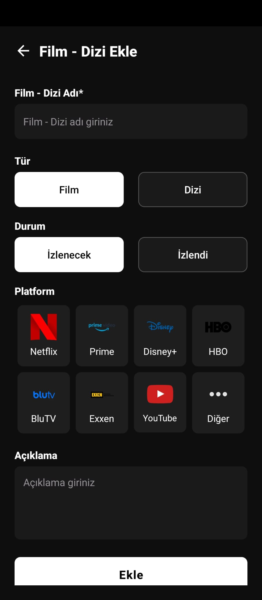
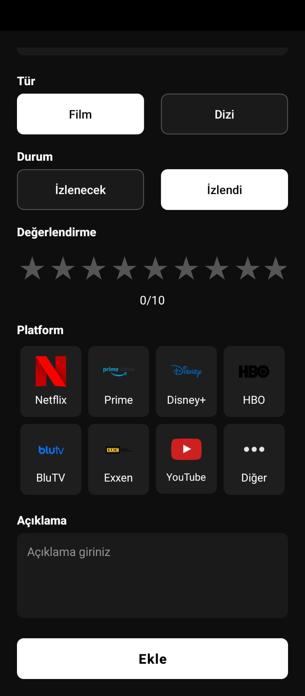
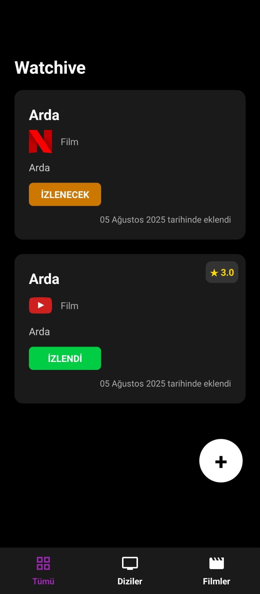
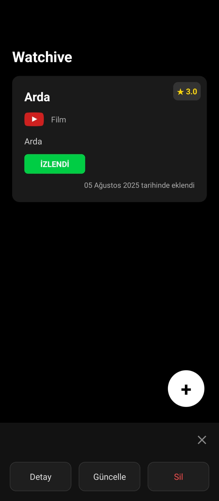

#  Watchive - Film-Dizi Takip

Watchive, izlediğiniz veya izlemek istediğiniz film ve dizileri listelemenizi sağlar. İçerikleri ‘İzlendi’ ya da ‘İzlenecek’ olarak işaretleyebilir, izlediğiniz içeriklere puan verebilir, platform seçebilir ve içerikle ilgili açıklamalar yazabilirsiniz.

---

##  1. Anasayfa 

Uygulamanın Anasayfasında henüz içerik eklenmemişse, ekrana “Henüz içerik yok…” şeklinde yönlendirici bir mesaj çıkıyor. Ortadaki + butonuyla film ya da dizi eklenebiliyor. Sayfanın en altında ise “Tümü”, “Diziler” ve “Filmler” olmak üzere üç sekmeli bir menü yer alıyor

---

##  2.Ekle 

Uygulamanın Ekle sayfasında kullanıcı, film ya da dizinin adını, türünü, izleme durumunu, izlediği platformu ve açıklamasını girer. "Ekle" butonuna bastığında içerik Anasayfa’da listelenir.

---

##  3. Ekle(Puanlama)

##  4. Anasayfada Listelenmesi

Kullanıcı, Ekle sayfasında içerik bilgilerini (ad, tür, izleme durumu, izlediği platform, açıklama ve varsa puan) girdikten sonra "Ekle" butonuna basar. Eklenen içerikler, Anasayfa’da görseldeki gibi listelenir.

---

##  5. Seçenek Menüsü

Kullanıcı, listelenen bir içeriğe tıkladığında ekranın altında Detay, Düzenle ve Sil seçeneklerini içeren bir menü açılır.

---

